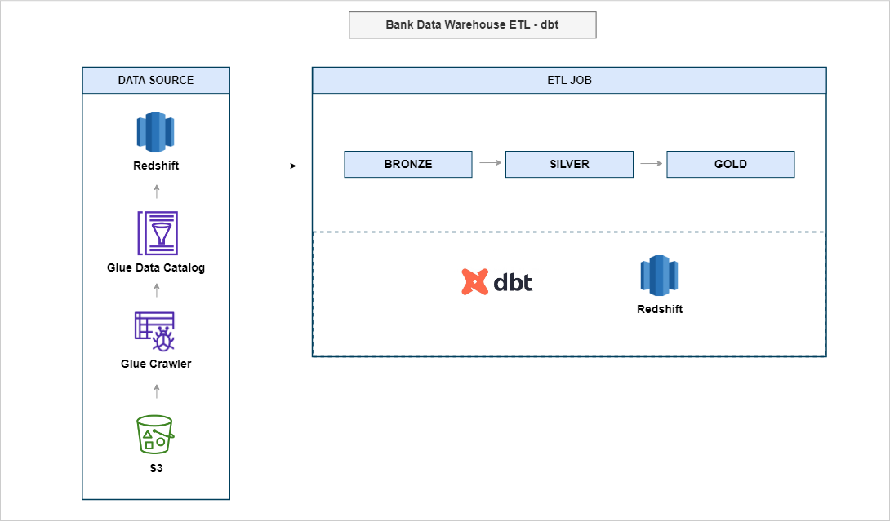

# Bank Data Warehouse with DBT and Redshift

## Project Description

**Objective/Goal**:
- Develop a comprehensive data warehouse solution using DBT and Amazon Redshift to manage banking data, enabling advanced analytics and reporting capabilities.

**Sector**:
- Finance

**Technologies Used**:
- **DBT (Data Build Tool)**: Used for transforming data in the warehouse by creating, testing, and managing data transformations.
- **Amazon Redshift**: Serves as the data warehousing solution.
- **Amazon S3**: Used for storing raw data and intermediate files.
- **AWS Glue**: Utilized for creating a metadata catalog and running crawlers on S3 data.
- **Python**: For generating mock data and automating data pipeline tasks.

## Data Source, Transformation & Output

**Architecture Overview**:
- The project utilizes a three-layer architecture: Bronze for raw external tables from AWS Glue, Silver for transformed staging data, and Gold for the final dimensional models used for analytics. For a detailed view of the architecture - 
.

**Data Sources**:
- Data is initially generated using the `generate_data.py` script located in the `Data` folder, creating 14 CSVs for both fact and dimension tables, including 9 fact tables and 5 dimension tables.

**Transformation Steps**:
- Transformations are handled by DBT. The [models folder](./DBT_Redshift/models) within the DBT_Redshift directory contains all the necessary transformations moving data from the Bronze layer to the Silver and Gold layers. See screenshots of each layer transformation:
    - Bronze Layer: 
      - 
    - DBT Run: 
      - 
    - Silver Layer: 
      - 
    - Gold Layer: 
      - 

**Output**:
- The transformed data is stored in Redshift, optimized for querying and analytics, thus supporting critical banking operations.

## Results

- The project successfully integrates complex data from multiple sources into a unified data warehouse.

## Learnings

- The project underscored the importance of careful design and implementation in cloud-based data warehousing and provided significant insights into the effective use of AWS and DBT for large-scale data management.
